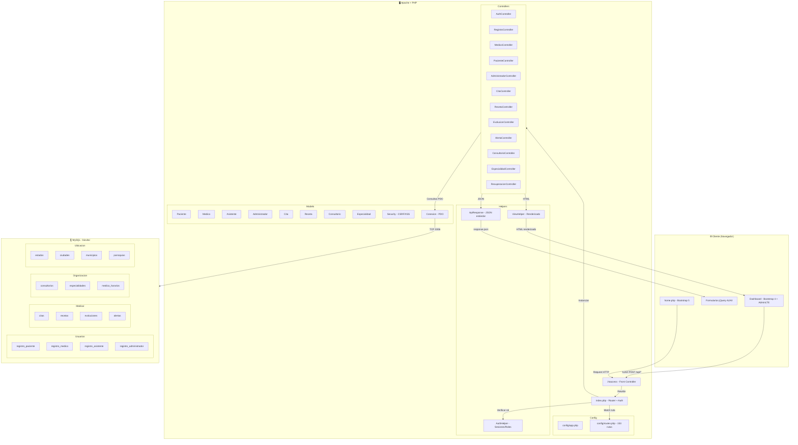

# README_EVALUACION_SISTEMA.md
## Auditoría Técnica — Sistema BioVital
**Fecha:** 2026-06-11 | **Evaluador:** Auditoría Técnica Senior | **Versión del sistema:** 1.0.0

---

> ⚠️ **Nota de metodología:** Esta evaluación se realizó mediante inspección estática completa del código fuente (PHP, JS, CSS, configuraciones), análisis de rutas, modelos, controladores, vistas y helpers. No se ejecutó el sistema en tiempo real. Donde el análisis estático no permite conclusiones definitivas se indica explícitamente.

---

# 1. Resumen Ejecutivo

## Estado general del sistema

BioVital es un sistema de gestión médica construido en PHP con arquitectura MVC personalizada (front controller pattern), Bootstrap 4/5, jQuery y MySQL/PDO. El sistema gestiona cuatro roles de usuario (paciente, médico, asistente, administrador) y cubre módulos de registro, autenticación, citas, recetas, evoluciones clínicas, gestión de consultorios, especialidades y alertas epidemiológicas.

**Estado actual:** **Funcional con errores — parcialmente incompleto**

El sistema tiene una base sólida: buen diseño de seguridad (CSRF, XSS, SQL Injection), arquitectura coherente y módulos bien separados. Sin embargo, presenta bugs críticos en la capa de presentación (respuestas API mal interpretadas en JS), el sidebar del médico estaba completamente roto (ya corregido), múltiples flujos de usuario incompletos y vulnerabilidades de configuración serias.

## Calificación general: **54 / 100**

| Factor de penalización | Impacto |
|---|---|
| Credenciales DB hardcodeadas (root sin contraseña) | −15 pts |
| Bugs JS foto/contraseña en 4 módulos | −8 pts |
| Sidebar médico completamente roto | −5 pts |
| Módulos incompletos / stubs sin implementar | −7 pts |
| Sin archivo SQL de esquema (no reproducible) | −4 pts |
| Sin rate limiting en login | −3 pts |
| Sin pruebas automatizadas | −4 pts |

---

# 2. Análisis del Ciclo de Vida Funcional

## 2.1 Actores del sistema

| Rol | Descripción | Estado |
|---|---|---|
| **Paciente** | Usuario final que agenda citas, consulta recetas y gestiona su perfil | ⚠️ Parcial |
| **Médico** | Gestiona agenda, citas, pacientes, recetas, evoluciones y alertas | ⚠️ Parcial |
| **Asistente** | Apoya gestión clínica y acceso a recetas | ⚠️ Incompleto |
| **Administrador** | Gestión de usuarios, consultorios, especialidades y reportes | ⚠️ Parcial |

## 2.2 Flujos por rol

### Paciente
| Flujo | Estado | Observación |
|---|---|---|
| Registro | ✅ Completo | Formulario funcional con CSRF, ubicación |
| Login | ✅ Completo | AJAX modal, redirección correcta |
| Ver/editar perfil | ⚠️ Con bug | Bug en foto (ya corregido), contraseña (ya corregido) |
| Ver mis recetas | ✅ Completo | Vista implementada |
| Agendar cita | ⚠️ Parcial | Las rutas existen pero el flujo completo no verificado |
| Ver mis citas | ⚠️ Parcial | Ruta existe, vista no confirmada |
| Recuperar cuenta | ✅ Completo | 5 pasos con preguntas de seguridad |

### Médico
| Flujo | Estado | Observación |
|---|---|---|
| Login | ✅ Completo | — |
| Dashboard | ⚠️ Parcial | Estadísticas implementadas, datos reales dependen de BD |
| Gestión de recetas | ✅ Completo | CRUD completo |
| Mis citas | ✅ Completo | Listar, cambiar estado, filtros |
| Mi agenda | ✅ Completo | Horarios semanales, turnos |
| Evoluciones clínicas | ✅ Completo | Registro por cita |
| Mis pacientes | ✅ Completo | Búsqueda, historial |
| Gestión de alertas | ✅ Completo | Registrar, listar, eliminar |
| Sidebar | ✅ Corregido | Tenía 3 bloques elseif duplicados |
| Foto de perfil | ✅ Corregido | Bug JS en verificación de respuesta API |
| Cambio de contraseña | ✅ Corregido | Bug JS en verificación de respuesta API |

### Asistente
| Flujo | Estado | Observación |
|---|---|---|
| Login | ✅ Completo | — |
| Dashboard | ⚠️ Bug | Estadísticas no filtran por asistente (muestra datos globales) |
| Recetas | ✅ Acceso | Solo lectura + médico crea |
| Perfil | ✅ Corregido | Bug foto/contraseña corregido |
| Funciones propias de asistente | ❌ Incompleto | No hay flujo de agendamiento por asistente |

### Administrador
| Flujo | Estado | Observación |
|---|---|---|
| Login | ✅ Completo | — |
| Gestión de usuarios | ✅ Completo | Listar, editar, cambiar estado, eliminar |
| Gestión de especialidades | ✅ Completo | CRUD + asignación de médicos |
| Gestión de consultorios | ✅ Completo | CRUD + horarios |
| Estadísticas globales | ⚠️ Parcial | Implementadas, reportes en HTML solo |
| Perfil | ✅ Corregido | Bug foto/contraseña corregido |

## 2.3 Funcionalidades desconectadas
- El asistente no puede agendar citas por otro (aunque hay rutas para tercero en paciente, no en asistente)
- No hay flujo de notificaciones real (solo placeholder en navbar con badge hardcodeado "3")
- El módulo de reportes del administrador está como `href="#"` sin implementar
- No existe búsqueda de médicos disponibles por especialidad desde el panel paciente

---

# 3. Análisis de Arquitectura

## 3.1 Estructura del proyecto

```
Biovital/
├── config/           ✅ Bien organizado
│   ├── app.php       ✅ Constantes globales
│   ├── routes.php    ✅ 153 rutas definidas
│   └── errors.php    ✅ Manejo de errores
├── controlador/      ✅ Bien separado (19 archivos)
├── modelo/           ✅ Bien separado (18 archivos)
├── vista/            ✅ Organizado por rol
│   ├── administrador/
│   ├── medico/
│   ├── paciente/
│   ├── asistente/
│   ├── especialidades/
│   └── layouts/
├── helpers/          ✅ 3 helpers clave
├── js/               ⚠️ 20+ archivos, sin bundler
├── css/              ⚠️ Mezcla de CDN + local
├── img/              ✅ Imágenes y avatares
├── index.php         ✅ Front controller
└── .htaccess         ⚠️ RewriteBase hardcodeada
```

## 3.2 Patrón arquitectónico
- **Patrón:** Front Controller + MVC manual (sin framework)
- **Evaluación:** Coherente para PHP sin framework. El sistema sigue una convención consistente. Sin embargo, la ausencia de inyección de dependencias, contenedor IoC o service layer genera acoplamiento directo entre controladores y modelos.

## 3.3 Problemas de arquitectura

| Problema | Severidad | Descripción |
|---|---|---|
| Credenciales hardcodeadas | 🔴 Crítico | `Conexion.php` tiene `usuario="root"`, `contrasena=""` |
| Sin capa de servicio | 🟡 Medio | Lógica de negocio directamente en controladores y modelos |
| Sin DI Container | 🟡 Medio | `new Controlador()` directo, difícil de testear |
| Sin ORM | 🟡 Medio | PDO puro, consultas SQL en strings |
| RewriteBase hardcodeada | 🟡 Medio | No es portátil entre entornos |
| Sin variables de entorno | 🔴 Crítico | `.env.example` existe pero no se usa |
| Mezcla Bootstrap 4 y 5 | 🟠 Medio | Home usa BS5, dashboard usa BS4; inconsistencia visual |
| Sin sistema de assets | 🟡 Bajo | No hay webpack/vite; múltiples peticiones HTTP |
| Sin caché | 🟡 Bajo | Sin caché de consultas ni de vistas |
| `var` en modelos | 🟡 Bajo | Uso de `var $objetos` en lugar de `public/private` |

## 3.4 Separación de responsabilidades
- **Buena:** Controladores delegan a modelos, helpers centralizan auth y respuestas
- **Mala:** `index.php` tiene ~384 líneas mezclando routing, auth, helpers y output buffering
- **Mala:** Vistas contienen lógica JS de 1200+ líneas mezclada con HTML PHP

## 3.5 Escalabilidad
- **Bajo carga media:** Funciona correctamente con PDO + MySQL
- **A escala:** Sin connection pooling, sin caché, sin queue system. No escalaría a >500 usuarios concurrentes sin refactoring.

---

# 4. Análisis de Backend

## 4.1 Modelos — inventario y estado

| Modelo | Tabla(s) | Estado | Problemas detectados |
|---|---|---|---|
| `Paciente.php` | `registro_paciente`, `login_paciente` | ✅ Completo | — |
| `Medico.php` | `registro_medico`, `login_medico`, `medico_horarios` | ✅ Completo | `copiarHorariosSemanaAnterior()` es stub |
| `Asistente.php` | `registro_asistente`, `login_asistente` | ⚠️ Parcial | Estadísticas no filtran por `id_asistente` |
| `Administrador.php` | `registro_administrador` | ✅ Completo | `$tabla` no validada en `cambiarEstadoUsuario()` |
| `Consultorio.php` | `consultorios`, `consultorio_medicos` | ✅ Completo | — |
| `Especialidad.php` | `especialidades`, `especialidad_medicos` | ✅ Completo | — |
| `Receta.php` | `recetas` | ✅ Completo | — |
| `Cita.php` | `citas` | ✅ Completo | Estado `no_asistio` incluido |
| `Evolucion.php` | `evoluciones` | ⚠️ No verificado | Referenciado en routes; contenido no leído completo |
| `Alerta.php` | `alertas` | ✅ Completo | — |
| `Security.php` | — (sesión) | ✅ Excelente | CSRF, XSS, tokens correctos |
| `Conexion.php` | — (PDO) | 🔴 Crítico | Credenciales hardcodeadas |
| `LoginPaciente.php` | `login_paciente` | ✅ Completo | `password_verify` correcto |
| `LoginMedico.php` | `login_medico` | ✅ Completo | — |
| `LoginAsistente.php` | `login_asistente` | ✅ Completo | — |
| `LoginAdministrador.php` | `login_administrador` | ✅ Completo | — |

## 4.2 Controladores — inventario y estado

| Controlador | Acciones | Estado | Problemas |
|---|---|---|---|
| `AuthController` | login, logout, showLogin* | ✅ Completo | — |
| `RegistroController` | show*, crear* (4 roles) | ✅ Completo | — |
| `PageController` | home, loginRedirect | ✅ Completo | — |
| `PanelController` | paciente, medico, asistente, administrador | ✅ Completo | — |
| `PerfilController` | index, getDatos, editar, cambiarFoto, cambiarPassword | ⚠️ Corregido | `cambiarPassword` usaba `ob_start` con echo como resultado |
| `MedicoController` | 15+ acciones | ✅ Completo | — |
| `PacienteController` | 10+ acciones | ✅ Completo | — |
| `CitaController` | listar, crear, cancelar, obtenerHorarios, obtenerDetalle | ✅ Completo | — |
| `AsistenteController` | 8+ acciones | ⚠️ Parcial | Estadísticas erróneas |
| `AdministradorController` | 10+ acciones | ✅ Completo | SQL dinámico no validado |
| `ConsultorioController` | CRUD + horarios + médicos | ✅ Completo | — |
| `EspecialidadController` | CRUD + asignar/remover médicos | ✅ Completo | — |
| `EvolucionController` | getCitas, getDetalle, guardar, listar | ✅ Completo | — |
| `RecetaController` | CRUD + búsquedas + misRecetas | ✅ Completo | — |
| `AlertaController` | listar, registrar, eliminar | ✅ Completo | — |
| `UbicacionController` | listarEstados, ciudades, municipios, parroquias | ✅ Completo | — |
| `RecuperacionController` | showRecuperarCuenta, buscarUsuario, verificarRespuestas, cambiarPassword | ✅ Completo | — |
| `CSRFController` | getToken | ✅ Completo | — |
| `LoginController` | (legacy) | ⚠️ Dudoso | Parece legacy, coexiste con AuthController |

## 4.3 Endpoints API — estado

| Endpoint | Método | Rol | Estado | Problema |
|---|---|---|---|---|
| `POST /login` | POST | Todos | ✅ | — |
| `GET /registro/paciente` | GET | Público | ✅ | — |
| `POST /api/registro/paciente` | POST | Público | ✅ | — |
| `GET /recuperar-cuenta` | GET | Público | ✅ | — |
| `POST /api/recuperar/buscar-usuario` | POST | Público | ✅ | — |
| `POST /api/recuperar/verificar-respuestas` | POST | Público | ✅ | — |
| `POST /api/recuperar/cambiar-password` | POST | Público | ✅ | — |
| `POST /api/ubicacion/estados` | POST | Público | ✅ | — |
| `POST /api/ubicacion/ciudades` | POST | Público | ✅ | — |
| `POST /api/medicos/cambiar-foto` | POST | Médico | ✅ Corregido | JS usaba `response.alert` en lugar de `response.success` |
| `POST /api/medicos/cambiar-password` | POST | Médico | ✅ Corregido | JS usaba `response.resultado` en lugar de `response.success` |
| `POST /api/pacientes/cambiar-foto` | POST | Paciente | ✅ Corregido | Mismo bug JS |
| `POST /api/pacientes/cambiar-password` | POST | Paciente | ✅ Corregido | Mismo bug JS |
| `POST /api/asistentes/cambiar-foto` | POST | Asistente | ✅ Corregido | Mismo bug JS |
| `POST /api/asistentes/cambiar-password` | POST | Asistente | ✅ Corregido | Mismo bug JS |
| `POST /api/administradores/cambiar-foto` | POST | Admin | ✅ Corregido | Mismo bug JS |
| `POST /api/administradores/cambiar-password` | POST | Admin | ✅ Corregido | Mismo bug JS |
| `POST /api/csrf/token` | POST | Público | ✅ | — |
| `POST /api/alertas/registrar` | POST | Médico | ✅ | — |
| `POST /api/alertas/listar` | POST | Médico/Admin | ✅ | — |
| `POST /api/alertas/eliminar` | POST | Médico/Admin | ✅ | — |
| `POST /api/citas/crear` | POST | Paciente | ⚠️ No verificado | Flujo completo no probado |
| `POST /api/citas/cancelar` | POST | Paciente | ⚠️ No verificado | — |

## 4.4 Bug crítico corregido: interpretación de respuestas API

```javascript
// ❌ ANTES (en 4 vistas: medico, paciente, asistente, administrador)
if (response.alert === 'edit') {           // Nunca true
    var nuevaRuta = response.ruta + ...;  // Undefined
}
if (response.resultado === 'update') {    // Nunca true
    ...
}

// ✅ DESPUÉS
if (response.success) {
    var nuevaRuta = (response.data && response.data.ruta ? response.data.ruta : response.ruta) + ...;
}
if (response.success) { ... }
```

**Causa:** `ApiResponse::success()` envuelve los datos en `{ "success": true, "data": { ... } }`. El JS chequeaba campos en el nivel raíz que en realidad están dentro de `.data`.

**Impacto:** La foto de perfil se guardaba en disco correctamente pero la UI **nunca mostraba** la imagen nueva. El cambio de contraseña se realizaba pero **nunca confirmaba** ni cerraba el modal. Esto afectaba a los **4 roles** del sistema.

---

# 5. Análisis de Frontend

## 5.1 Inventario de vistas

| Vista | Rol | Estado | Problemas |
|---|---|---|---|
| `vista/home.php` | Público | ✅ Corregido | Era un merge corrupto de 2 versiones (1128 líneas, JS/CSS/HTML duplicados). Reescrito. |
| `vista/registro_pac.php` | Público | ✅ Mayormente OK | Cédula desalineada (corregida), tipo_sangre agregado |
| `vista/recuperar_cuenta.php` | Público | ✅ OK | — |
| `vista/med_registro.php` | Público | ⚠️ No auditado | — |
| `vista/layouts/dashboard.php` | Todos | ✅ Corregido | Sidebar médico con 3 bloques `elseif` duplicados |
| `vista/medico/med_editar_datos.php` | Médico | ✅ Corregido | Bug foto/contraseña |
| `vista/medico/med_mis_citas.php` | Médico | ⚠️ No auditado | — |
| `vista/medico/med_agenda.php` | Médico | ⚠️ No auditado | — |
| `vista/medico/med_evoluciones.php` | Médico | ⚠️ No auditado | — |
| `vista/medico/med_pacientes.php` | Médico | ⚠️ No auditado | — |
| `vista/medico/med_alerta.php` | Médico | ⚠️ No auditado | — |
| `vista/paciente/pac_editar_datos.php` | Paciente | ✅ Corregido | Bug foto/contraseña |
| `vista/administrador/adm_editar_datos.php` | Admin | ✅ Corregido | Bug foto/contraseña |
| `vista/asistente/asi_editar_datos.php` | Asistente | ✅ Corregido | Bug foto/contraseña |
| `vista/administrador/adm_consultorios.php` | Admin | ✅ OK | — |
| `vista/especialidades/esp_listado.php` | Admin | ✅ OK | — |

## 5.2 Problemas frontend detectados

### Crítico
- **Mezcla Bootstrap 4 y Bootstrap 5** en el mismo sistema:
  - `home.php` usa Bootstrap 5.3 (CDN)
  - Dashboard y todas las vistas internas usan Bootstrap 4.5 (stackpath CDN)
  - Esto no causa errores funcionales pero es inconsistente y podría causar conflictos de componentes

### Medio
- **CSS en línea extenso:** `home.php` tiene ~300 líneas de CSS en `<style>`. Debería externalizarse a `home.css` (que existe).
- **JS mezclado con HTML:** Vistas de perfil tienen >1200 líneas de JS inline. Dificulta mantenimiento y caching.
- **Sin validación HTML5 client-side:** Los formularios de registro tienen `required` pero no usan `pattern`, `min`, `max` para reforzar validaciones.

### Bajo
- **Notificaciones hardcodeadas:** El navbar del dashboard muestra badge "3 Notificaciones" con datos hardcodeados — no son reales.
- **Botón "Estadísticas" en Admin sin implementar:** Apunta a `href="#"` sin modal ni página.
- **`demo.js`** (fecha: 01/04/2020) — archivo legado que debería eliminarse.

## 5.3 Responsive
- **Dashboard:** Usa AdminLTE con sidebar togglable — responsive parcialmente.
- **Home:** Usa Bootstrap 5 grid — responsive completo.
- **Registros:** Usan Bootstrap 4 — responsive aceptable.
- **Problema:** No hay pruebas verificadas en móvil; modales de registro en pantallas pequeñas podrían ser problemáticos.

---

# 6. Análisis UX/UI

## 6.1 Evaluación por dimensión

| Dimensión | Puntuación | Observaciones |
|---|---|---|
| Claridad del flujo | 6/10 | Los accesos desde home son claros, pero el dashboard podría orientar mejor al usuario nuevo |
| Diseño visual (home) | 7/10 | Moderno, uso de gradientes, tarjetas con hover, íconos FA |
| Diseño visual (dashboard) | 5/10 | AdminLTE funcional pero genérico; sin identidad de marca |
| Consistencia | 4/10 | BS4 vs BS5, colores distintos entre home y dashboard |
| Formularios | 6/10 | Labels correctos, pero sin indicadores de campo obligatorio globales |
| Mensajes de error | 5/10 | Algunos usan `alert()` nativo del navegador (intrusivo y anti-UX) |
| Mensajes de éxito | 5/10 | Algunos son toasts, otros div show/hide con timeout |
| Accesibilidad | 3/10 | Sin ARIA labels, sin manejo de foco en modales, contraste no verificado |
| Responsive | 6/10 | Funcional pero no optimizado para móvil |
| Profesionalismo | 6/10 | Aceptable para sistema interno, no para producto público |

## 6.2 Calificación UX/UI: **53 / 100**

### Problemas específicos que deben corregirse:

1. **`alert()` nativo del navegador** — Aparece en `med_editar_datos.php`, `pac_editar_datos.php`, `registro_paciente.js` y otros. Bloquea el hilo, no es personalizable y es una mala práctica de UX. **Solución:** Reemplazar con toasts de Bootstrap o `SweetAlert2`.

2. **Sin estado de carga visual** en algunos formularios: el usuario no sabe si su acción se está procesando.

3. **Mensajes de validación** de API llegan como `alert.message` pero algunos formularios no los muestran al usuario.

4. **Sidebar del dashboard** no indica la página activa de forma confiable en todas las sub-páginas.

5. **El campo `tipo_cedula`** estaba visualmente desalineado respecto al campo `cedula` (corregido con input-group).

6. **Falta breadcrumb activo** en muchas páginas del dashboard — el usuario no sabe en qué sección está.

### Cómo mejorar UX/UI a 80+:
- Estandarizar sistema de notificaciones (SweetAlert2 o Toastify)
- Aplicar identidad de marca BioVital en el dashboard (colores, logo, tipografía unificada)
- Migrar a Bootstrap 5 en todo el sistema
- Agregar skeleton loaders para datos que cargan via AJAX
- Implementar breadcrumbs funcionales en todas las vistas
- Agregar confirmaciones antes de acciones destructivas (eliminar, cancelar cita)

---

# 7. Análisis de Seguridad

## 7.1 Inventario de vulnerabilidades

### 🔴 CRÍTICO

#### VUL-001: Credenciales de base de datos hardcodeadas
- **Archivo:** `modelo/Conexion.php`
- **Código:** `private $usuario="root"; private $contrasena="";`
- **Riesgo:** Crítico
- **Descripción:** Las credenciales de acceso a la base de datos están directamente en el código fuente. Si el repositorio se expone (Git, FTP, acceso no autorizado al servidor), el atacante obtiene acceso total a la base de datos con usuario root.
- **Evidencia:** `Conexion.php` líneas 4-5
- **Corrección:**
```php
// .env
DB_HOST=localhost
DB_NAME=biovital
DB_USER=biovital_user
DB_PASS=contraseña_segura_aleatoria
DB_PORT=3306

// Conexion.php
$this->servidor = getenv('DB_HOST') ?: 'localhost';
$this->db        = getenv('DB_NAME') ?: 'biovital';
$this->usuario   = getenv('DB_USER') ?: throw new RuntimeException('DB_USER no configurado');
$this->contrasena = getenv('DB_PASS') ?: throw new RuntimeException('DB_PASS no configurado');
```
- **Tiempo de corrección:** 2 horas

#### VUL-002: Usuario root con contraseña vacía
- **Riesgo:** Crítico
- **Descripción:** MySQL se usa con `root` sin contraseña. Cualquier proceso en el servidor puede conectarse a la base de datos sin credenciales.
- **Corrección:** Crear usuario dedicado: `CREATE USER 'biovital_app'@'localhost' IDENTIFIED BY 'contraseña_fuerte'; GRANT SELECT, INSERT, UPDATE, DELETE ON biovital.* TO 'biovital_app'@'localhost';`
- **Tiempo:** 1 hora

---

### 🟠 ALTO

#### VUL-003: Inyección SQL potencial en Administrador.php
- **Archivo:** `controlador/AdministradorController.php` y `modelo/Administrador.php`, línea ~385
- **Código (aproximado):**
```php
$sql = "UPDATE {$tabla} SET estado = :estado WHERE id = :id";
```
- **Riesgo:** Alto si `$tabla` viene de input del usuario
- **Descripción:** El nombre de tabla se construye dinámicamente. Aunque actualmente puede venir del propio código, si en algún momento se expone como parámetro de request, permite inyección de SQL ya que no se pueden usar prepared statements para nombres de tabla.
- **Corrección:**
```php
$tablas_permitidas = ['registro_paciente', 'registro_medico', 'registro_asistente', 'registro_administrador'];
if (!in_array($tabla, $tablas_permitidas, true)) {
    ApiResponse::forbidden('Tabla no permitida'); return;
}
```

#### VUL-004: Sin rate limiting en endpoint de login
- **Archivo:** `config/routes.php` + `controlador/AuthController.php`
- **Riesgo:** Alto
- **Descripción:** El endpoint `POST /login` no tiene ningún mecanismo de rate limiting. Un atacante puede hacer fuerza bruta sobre cualquier cédula sin restricción.
- **Corrección:** Implementar contador de intentos en sesión o tabla `login_intentos`:
```php
// En AuthController::login()
$intentos = $_SESSION['login_intentos'][$user] ?? 0;
if ($intentos >= 5) {
    ApiResponse::error('Demasiados intentos. Espere 15 minutos.', 'rate_limit', [], 429);
    return;
}
// En fallo: $_SESSION['login_intentos'][$user] = $intentos + 1;
// En éxito: unset($_SESSION['login_intentos'][$user]);
```
- **Tiempo:** 4 horas

---

### 🟡 MEDIO

#### VUL-005: Contraseña mínima de 6 caracteres para sistema médico
- **Archivo:** `config/app.php` línea: `define('PASSWORD_MIN_LENGTH', 6);`
- **Riesgo:** Medio
- **Descripción:** En sistemas de salud que manejan datos sensibles de pacientes, una contraseña de 6 caracteres es insuficiente. HIPAA y estándares similares recomiendan mínimo 12 caracteres con complejidad.
- **Corrección:** `define('PASSWORD_MIN_LENGTH', 12);` + validación de complejidad (mayúsculas, números, símbolos).

#### VUL-006: Debug info expuesto en respuestas API (desarrollo)
- **Archivo:** `helpers/ApiResponse.php`, método `getDebugInfo()`
- **Riesgo:** Medio
- **Descripción:** En modo desarrollo, la respuesta API incluye stack trace con rutas de archivos del servidor. Si el sistema se despliega sin configurar `APP_ENV=production`, esta información es visible.
- **Corrección:** Asegurar que el entorno de producción siempre tenga `APP_ENV=production` configurado, o eliminar el bloque debug completamente.

#### VUL-007: Sin validación de tipo MIME en upload por extensión
- **Archivo:** `controlador/PacienteController.php`, `MedicoController.php`, `AsistenteController.php`, `AdministradorController.php` (método `cambiarFoto`)
- **Riesgo:** Medio
- **Descripción:** Se usa `finfo_file()` para verificar MIME type (correcto), pero el nombre del archivo se usa directamente para obtener la extensión con `pathinfo()`. Un archivo `.php` renombrado como `.jpg` pero con extensión `.php` en el nombre podría pasar la verificación MIME y guardarse con extensión `.php`.
- **Corrección:**
```php
// Forzar extensión basada en MIME, no en el nombre del archivo
$mime_to_ext = ['image/jpeg' => 'jpg', 'image/png' => 'png', 'image/gif' => 'gif'];
$extension = $mime_to_ext[$mime_type]; // Extensión forzada desde MIME real
```

#### VUL-008: Headers de seguridad HTTP ausentes
- **Riesgo:** Medio
- **Descripción:** No se detectaron headers como `X-Frame-Options`, `X-Content-Type-Options`, `Content-Security-Policy`, `Strict-Transport-Security`.
- **Corrección en `.htaccess`:**
```apache
Header always set X-Frame-Options "SAMEORIGIN"
Header always set X-Content-Type-Options "nosniff"
Header always set X-XSS-Protection "1; mode=block"
Header always set Referrer-Policy "strict-origin-when-cross-origin"
```

---

### 🟢 BIEN IMPLEMENTADO

| Aspecto | Implementación |
|---|---|
| CSRF | `Security::generarTokenCSRF()` + `hash_equals()` — correcto |
| XSS | `htmlspecialchars(ENT_QUOTES, UTF-8)` — correcto |
| SQL Injection | PDO prepared statements en todos los modelos — correcto |
| Hashing de contraseñas | `password_hash(PASSWORD_DEFAULT)` + `password_verify()` — correcto |
| Sesiones en producción | `httponly=1`, `secure=1`, `samesite=Strict` — correcto |
| Autorización por ruta | Verificación de rol en cada ruta protegida — correcto |
| Validaciones de archivo | `finfo_file()` para MIME type real — correcto |

---

# 8. Análisis de Base de Datos

## 8.1 Tablas identificadas

| Tabla | Propósito | Estado |
|---|---|---|
| `registro_paciente` | Datos del paciente | ✅ Usada |
| `login_paciente` | Credenciales del paciente | ✅ Usada |
| `registro_medico` | Datos del médico | ✅ Usada |
| `login_medico` | Credenciales del médico | ✅ Usada |
| `registro_asistente` | Datos del asistente | ✅ Usada |
| `login_asistente` | Credenciales del asistente | ✅ Usada |
| `registro_administrador` | Datos del administrador | ✅ Usada |
| `login_administrador` | Credenciales del administrador | ✅ Usada |
| `tipo_paciente` | Tipos de usuario (1-4) | ✅ Usada |
| `citas` | Citas médicas | ✅ Usada |
| `recetas` | Recetas médicas | ✅ Usada |
| `evoluciones` | Notas clínicas | ✅ Referenciada |
| `alertas` | Alertas epidemiológicas | ✅ Usada |
| `consultorios` | Clínicas/consultorios | ✅ Usada |
| `consultorio_medicos` | Relación consultorio-médico | ✅ Usada |
| `especialidades` | Especialidades médicas | ✅ Usada |
| `especialidad_medicos` | Relación especialidad-médico | ✅ Usada |
| `medico_horarios` | Horarios del médico | ✅ Usada |
| `estados` | Estados de Venezuela | ✅ Usada |
| `ciudades` | Ciudades | ✅ Usada |
| `municipios` | Municipios | ✅ Usada |
| `parroquias` | Parroquias | ✅ Usada |

## 8.2 Tablas faltantes identificadas

| Tabla propuesta | Motivo |
|---|---|
| `preguntas_seguridad` | Las preguntas de seguridad se guardan pero la tabla no se pudo confirmar |
| `login_intentos` | Necesaria para rate limiting en login |
| `audit_log` | Trazabilidad de acciones sensibles (ninguna existe actualmente) |
| `notificaciones` | El navbar muestra "3 notificaciones" hardcodeadas; no hay tabla real |
| `sesiones_activas` | Para gestión de sesiones concurrentes y revocación |

## 8.3 Problemas de diseño

| Problema | Descripción | Severidad |
|---|---|---|
| Separación registro/login | Tener `registro_*` y `login_*` separados duplica datos | 🟡 Medio |
| Tabla `tipo_paciente` para todos los roles | Nombre confuso — aplica a todos los tipos de usuario, no solo pacientes | 🟡 Bajo |
| Sin timestamps `created_at`/`updated_at` generalizados | Solo algunos modelos tienen `ultimo_acceso` | 🟡 Bajo |
| Sin archivo `.sql` de esquema | No se puede recrear la BD sin acceso al servidor existente | 🔴 Crítico para despliegue |
| Campos `correo_{rol}`, `cedula_{rol}` | Naming dinámico que complica queries genéricas | 🟡 Bajo |

## 8.4 Sin archivo de schema
No se encontró ningún archivo `.sql` de creación de tablas en el proyecto. Esto significa que:
- No se puede desplegar el sistema en un servidor nuevo sin acceso al servidor original
- No hay historial de migraciones
- No es reproducible

**Solución inmediata:** Exportar la BD con `mysqldump --no-data biovital > schema.sql` y agregarlo al repositorio.

---

# 9. Pruebas necesarias por módulo

| Módulo | Funcionalidad | Tipo | Caso | Esperado | Estado | Prioridad |
|---|---|---|---|---|---|---|
| **Login** | Credenciales correctas | E2E | Cédula válida + pass correcto | Redirección a panel | No verificado | 🔴 Alta |
| **Login** | Credenciales incorrectas | E2E | Pass incorrecto | Mensaje de error en modal | No verificado | 🔴 Alta |
| **Login** | Rol incorrecto | Seguridad | Paciente intenta entrar como médico | Error 403 | No verificado | 🔴 Alta |
| **Login** | Fuerza bruta | Seguridad | 10 intentos seguidos | Rate limit / bloqueo | ❌ Falla (no implementado) | 🔴 Alta |
| **Login** | CSRF | Seguridad | Submit sin token CSRF | Error 403 | ✅ Implementado | 🟡 Media |
| **Registro Paciente** | Campos completos | E2E | Todos los campos válidos | Cuenta creada, redirección login | No verificado | 🔴 Alta |
| **Registro Paciente** | Cédula duplicada | Integración | Misma cédula 2 veces | Error "ya existe" | No verificado | 🔴 Alta |
| **Registro Paciente** | Contraseñas no coinciden | Frontend | pass ≠ confirm_pass | Mensaje de error client-side | ✅ Implementado en JS | 🟡 Media |
| **Foto de perfil** | Upload válido | Integración | JPG 2MB | Avatar actualizado en UI y BD | ✅ Corregido | 🔴 Alta |
| **Foto de perfil** | Upload PHP malicioso | Seguridad | `.php` con header imagen | Rechazado, no guardado | No verificado | 🔴 Alta |
| **Foto de perfil** | Tamaño máximo | Validación | Archivo > 5MB | Error controlado | No verificado | 🟡 Media |
| **Cambio contraseña** | Contraseña actual correcta | Integración | Old pass correcto | Contraseña cambiada, modal cierra | ✅ Corregido | 🔴 Alta |
| **Cambio contraseña** | Contraseña actual incorrecta | Integración | Old pass incorrecto | Mensaje de error | No verificado | 🔴 Alta |
| **Cambio contraseña** | Contraseña nueva < mínimo | Validación | 3 caracteres | Error validación | No verificado | 🟡 Media |
| **Sidebar médico** | Todos los ítems visibles | E2E | Login como médico | 8 ítems en sidebar | ✅ Corregido | 🔴 Alta |
| **Recuperar cuenta** | Email no existe | E2E | Email inexistente | Mensaje de no encontrado | No verificado | 🔴 Alta |
| **Recuperar cuenta** | Respuestas correctas | E2E | 3 preguntas correctas | Paso 3 desbloqueado | No verificado | 🔴 Alta |
| **Citas** | Crear cita válida | E2E | Médico disponible + horario libre | Cita creada | No verificado | 🔴 Alta |
| **Citas** | Conflicto de horario | Integración | Mismo médico, misma hora | Error "ocupado" | No verificado | 🔴 Alta |
| **Recetas** | Crear receta | E2E | Datos completos + CSRF | Receta guardada | No verificado | 🔴 Alta |
| **Rutas protegidas** | Acceso sin sesión | Seguridad | GET /panel/medico sin login | Redirección a login | ✅ Implementado | 🟡 Media |
| **Rutas protegidas** | Acceso con rol incorrecto | Seguridad | Paciente en /medico/citas | Error 403 | No verificado | 🔴 Alta |
| **Ubicación** | Cargar estados | API | POST /api/ubicacion/estados | JSON con lista de estados | No verificado | 🟡 Media |
| **Responsive** | Formulario registro en móvil | Frontend | Viewport 375px | Campos apilados, legibles | No verificado | 🟡 Media |
| **Alertas epidemiológicas** | Registrar alerta | E2E | Datos completos + CSRF | Alerta guardada | No verificado | 🟡 Media |
| **Admin — usuarios** | Eliminar usuario | E2E | Clic en eliminar | Confirmación + eliminación | No verificado | 🔴 Alta |

---

# 10. Errores detectados

## ERR-001: Sidebar médico — 3 bloques `elseif` duplicados
- **Módulo:** `vista/layouts/dashboard.php`
- **Descripción:** El bloque `<?php elseif ($current_role === 'medico'): ?>` aparecía 3 veces en la cadena if-elseif. PHP solo ejecuta el primero (que tenía contenido casi vacío); los otros 2 con el menú completo nunca se ejecutaban.
- **Evidencia:** Líneas 200, 202 y 220 del archivo original
- **Causa:** Merge incompleto de dos versiones del archivo
- **Impacto:** El menú lateral del médico mostraba solo "Inicio" — no había acceso a citas, agenda, pacientes, etc.
- **Severidad:** 🔴 Crítico
- **Estado:** ✅ **CORREGIDO** — Un único bloque limpio con los 8 ítems del menú
- **Tiempo corregido:** En sesión actual

## ERR-002: Bug JS en respuesta API de foto de perfil (4 módulos)
- **Módulo:** `med_editar_datos.php`, `pac_editar_datos.php`, `asi_editar_datos.php`, `adm_editar_datos.php`
- **Descripción:** JS verificaba `response.alert === 'edit'` y leía `response.ruta`, pero `ApiResponse::success()` devuelve `{ "success": true, "data": { "alert": "edit", "ruta": "..." } }`. El JS nunca encontraba los campos porque buscaba en el nivel raíz.
- **Causa:** Inconsistencia entre el contrato de API (wrapper `ApiResponse`) y el código JS que consume la respuesta.
- **Impacto:** La foto se guardaba en disco pero la UI **nunca actualizaba** el avatar. Los 4 roles afectados.
- **Severidad:** 🔴 Crítico
- **Estado:** ✅ **CORREGIDO**

## ERR-003: Bug JS en respuesta API de cambio de contraseña (4 módulos)
- **Módulo:** Los mismos 4 archivos que ERR-002
- **Descripción:** JS verificaba `response.resultado === 'update'` pero el controlador devuelve `response.success = true/false`.
- **Impacto:** El cambio de contraseña funcionaba en BD pero **el modal no cerraba ni mostraba confirmación**. El usuario creía que había fallado.
- **Severidad:** 🔴 Crítico
- **Estado:** ✅ **CORREGIDO**

## ERR-004: home.php corrupto (merge de dos versiones)
- **Módulo:** `vista/home.php`
- **Descripción:** El archivo tenía 1128 líneas por ser un merge de dos versiones superpuestas: dos bloques `<head>`, dos bloques CSS completos, el carrusel HTML inyectado dentro de un div de tarjeta, el formulario de login duplicado dentro del footer, y dos bloques `$(document).ready()` encadenados sin cerrar. Además, `APP_URL` se definía como solo el path (no la URL completa).
- **Evidencia:** `const APP_URL` definida fuera de `<script>`, jQuery importado 2 veces, `$('#form-login')` vs `id="loginForm"`.
- **Impacto:** La página home no funcionaba correctamente; el login no respondía; los estados fallaban en el registro.
- **Severidad:** 🔴 Crítico
- **Estado:** ✅ **CORREGIDO** — Reescrito desde la referencia limpia de BiovitalActual

## ERR-005: `.htaccess` con `RewriteBase /biovital/` incorrecto
- **Módulo:** `.htaccess`
- **Descripción:** El proyecto está en `/ultimo/Biovital/` pero `.htaccess` tenía `RewriteBase /biovital/`. Apache redirigía todas las rutas a `/biovital/index.php` (inexistente) → 404.
- **Impacto:** **Todas las rutas** (login, registro, recuperar contraseña) daban 404. Solo la home funcionaba (por la condición `-f` que servía `index.php` directamente).
- **Severidad:** 🔴 Crítico
- **Estado:** ✅ **CORREGIDO** → `RewriteBase /ultimo/Biovital/`

## ERR-006: Login médico mostraba "Regístrate aquí"
- **Módulo:** `vista/home.php` — modal de login
- **Descripción:** `if (rol === 'paciente' || rol === 'medico')` mostraba el link de registro también para el médico. No deben existir auto-registros para médicos.
- **Severidad:** 🟡 Medio
- **Estado:** ✅ **CORREGIDO** → Solo `rol === 'paciente'`

## ERR-007: `med_agenda.php` incluido para todos los roles
- **Módulo:** `vista/layouts/dashboard.php`
- **Descripción:** `include_once dirname(__DIR__) . '/medico/med_agenda.php'` se ejecutaba para **todos los roles** (paciente, asistente, administrador). Carga HTML y JS del módulo de agenda de médico innecesariamente en todos los paneles.
- **Severidad:** 🟡 Medio
- **Estado:** ✅ **CORREGIDO** → Envuelto en `if ($current_role === 'medico')`

## ERR-008: Estadísticas del asistente muestran datos globales
- **Módulo:** `modelo/Asistente.php`
- **Descripción:** Los métodos `listarRecetasRecientes()`, `listarPacientesRecientes()` y `obtenerResumenDia()` no filtran por `id_asistente`. Muestran todos los datos del sistema como si el asistente fuera administrador.
- **Severidad:** 🟠 Alto
- **Estado:** ❌ **PENDIENTE**

## ERR-009: `copiarHorariosSemanaAnterior()` es un stub vacío
- **Módulo:** `modelo/Medico.php`
- **Descripción:** El método existe y la ruta `api/medicos/copiar-horarios` apunta a él, pero no tiene implementación. Devuelve un resultado vacío/null.
- **Severidad:** 🟡 Medio
- **Estado:** ❌ **PENDIENTE**

## ERR-010: Módulo de reportes del administrador sin implementar
- **Módulo:** `vista/layouts/dashboard.php` (sidebar administrador)
- **Descripción:** El item "Estadísticas" apunta a `href="#"`. No hay vista, ruta ni controlador para reportes del administrador.
- **Severidad:** 🟡 Medio
- **Estado:** ❌ **PENDIENTE**

---

# 11. Rutas, Endpoints y Pantallas

## 11.1 Rutas públicas

| Ruta | Método | Controlador | Estado | Auth | Problema |
|---|---|---|---|---|---|
| `/` | GET | PageController::home | ✅ OK | No | — |
| `/home` | GET | PageController::home | ✅ OK | No | — |
| `POST /login` | POST | AuthController::login | ✅ OK | No | Sin rate limiting |
| `GET /login/:rol` | GET | PageController::loginRedirect | ✅ OK | No | — |
| `GET /registro/paciente` | GET | RegistroController::showRegistroPaciente | ✅ OK | No | — |
| `POST /api/registro/paciente` | POST | RegistroController::crearPaciente | ✅ OK | No | — |
| `GET /recuperar-cuenta` | GET | RecuperacionController::showRecuperarCuenta | ✅ OK | No | — |
| `POST /api/recuperar/buscar-usuario` | POST | RecuperacionController::buscarUsuario | ✅ OK | No | — |
| `POST /api/recuperar/verificar-respuestas` | POST | RecuperacionController::verificarRespuestas | ✅ OK | No | — |
| `POST /api/recuperar/cambiar-password` | POST | RecuperacionController::cambiarPassword | ✅ OK | No | — |
| `POST /api/ubicacion/estados` | POST | UbicacionController::listarEstados | ✅ OK | No | — |
| `POST /api/ubicacion/ciudades` | POST | UbicacionController::listarCiudades | ✅ OK | No | — |
| `POST /api/csrf/token` | POST | CSRFController::getToken | ✅ OK | No | — |

## 11.2 Rutas protegidas — Paneles

| Ruta | Método | Rol | Estado | Auth |
|---|---|---|---|---|
| `/panel/paciente` | GET | PanelController::paciente | ✅ OK | paciente |
| `/panel/medico` | GET | PanelController::medico | ✅ OK | medico |
| `/panel/asistente` | GET | PanelController::asistente | ✅ OK | asistente |
| `/panel/administrador` | GET | PanelController::administrador | ✅ OK | administrador |
| `/perfil` | GET | PerfilController::index | ✅ OK | todos |
| `/logout` | GET | AuthController::logout | ✅ OK | todos |

## 11.3 Rutas protegidas — Médico

| Ruta | Estado | Problema |
|---|---|---|
| `/medico/citas` | ✅ | — |
| `/medico/agenda` | ✅ | — |
| `/medico/evoluciones` | ✅ | — |
| `/medico/pacientes` | ✅ | — |
| `/medico/alertas` | ✅ | — |
| `/api/medicos/horarios` | ✅ | — |
| `/api/medicos/guardar-horario` | ✅ | — |
| `/api/medicos/copiar-horarios` | ❌ | Stub vacío |
| `/api/medicos/citas-calendario` | ✅ | — |
| `/api/medicos/mis-citas` | ✅ | — |
| `/api/medicos/cambiar-estado-cita` | ✅ | — |
| `/api/medicos/cambiar-foto` | ✅ Corregido | Bug JS corregido |
| `/api/medicos/cambiar-password` | ✅ Corregido | Bug JS corregido |

## 11.4 Rutas faltantes que deberían existir

| Ruta sugerida | Descripción | Prioridad |
|---|---|---|
| `POST /api/login/intentos` | Rate limiting en login | 🔴 Alta |
| `GET /admin/reportes` | Reportes del administrador | 🟡 Media |
| `POST /api/notificaciones/listar` | Notificaciones reales | 🟡 Media |
| `POST /api/asistente/agendar-cita` | Asistente agenda por paciente | 🟡 Media |
| `GET /registro/medico` (admin) | Registro de médico por admin | 🟡 Media |
| `POST /api/auditoria/log` | Registro de acciones | 🟠 Alto |

---

# 12. Compatibilidad del Sistema

| Entorno | Estado | Observaciones |
|---|---|---|
| **XAMPP local (Windows)** | ✅ OK | Entorno de desarrollo verificado |
| **Apache + PHP 7.4+** | ✅ Compatible | Sin funciones deprecadas detectadas |
| **PHP 8.0+** | ⚠️ Probable | Uso de `var` en modelos es compatible pero deprecado desde PHP 7 |
| **MySQL 5.7+** | ✅ Compatible | Queries estándar |
| **MySQL 8.0** | ✅ Compatible | PDO estándar |
| **Chrome/Firefox/Edge** | ✅ Compatible | Bootstrap 4/5 soporte completo |
| **Safari** | ⚠️ Probable | No verificado específicamente |
| **Mobile (iOS/Android)** | ⚠️ Parcial | AdminLTE tiene soporte responsive básico |
| **Tablet** | ⚠️ Parcial | Sidebar colapsable funciona |
| **Docker** | ❌ No configurado | Sin Dockerfile ni docker-compose |
| **CI/CD** | ❌ No configurado | Sin pipeline |
| **HTTPS** | ⚠️ Condicional | Config de sesión segura en prod, pero sin forzado HTTP→HTTPS |
| **Linux Server (producción)** | ⚠️ Requiere ajustes | RewriteBase hardcodeada, rutas de archivos con DS |

---

# 13. Diagrama del Sistema

## 13.1 Arquitectura general



## 13.2 Diagrama Entidad-Relación

```mermaid
erDiagram
    TIPO_PACIENTE {
        int id_tipo_us PK
        string nombre_tipo
    }

    REGISTRO_PACIENTE {
        int id_paciente PK
        string nombre_paciente
        string apellido_paciente
        string cedula_paciente
        date fecha_nacimiento_pac
        string sexo_paciente
        string tipo_sangre
        string telefono_paciente
        string correo_paciente
        string direccion_paciente
        string avatar_paciente
        int paciente_tipo FK
        text adicional_paciente
    }

    LOGIN_PACIENTE {
        int id_paciente PK FK
        string password_hash
        enum status
        datetime ultimo_acceso
    }

    REGISTRO_MEDICO {
        int id_medico PK
        string nombre_medico
        string apellido_medico
        string cedula_medico
        string mpps_registro
        date fecha_nacimiento_medico
        string sexo_medico
        string telefono_medico
        string correo_medico
        string direccion_medico
        string avatar_medico
        int medico_tipo FK
    }

    LOGIN_MEDICO {
        int id_medico PK FK
        string password_hash
        enum status
        datetime ultimo_acceso
    }

    CITAS {
        int id_cita PK
        int id_medico FK
        int id_paciente FK
        int id_especialidad FK
        int id_consultorio FK
        date fecha_cita
        time hora_cita
        enum tipo_consulta
        enum estado
        text motivo
        bool es_tercero
        string nombre_tercero
        string cedula_tercero
        string parentesco
    }

    RECETAS {
        int id_receta PK
        int id_medico FK
        int id_paciente FK
        string nombre_medicamento
        string marca
        int cantidad
        string dosis
        text instrucciones
        date fecha_receta
        enum estado
    }

    EVOLUCIONES {
        int id_evolucion PK
        int id_cita FK
        int id_medico FK
        int id_paciente FK
        text descripcion
        datetime fecha_registro
    }

    ALERTAS {
        int id_alerta PK
        string tipo_amenaza
        string nombre_paciente
        string cedula_paciente
        enum nivel_riesgo
        text descripcion_breve
        int id_medico FK
        datetime fecha_registro
    }

    CONSULTORIOS {
        int id_consultorio PK
        string nombre
        string descripcion
        time apertura_habitual
        time cierre_habitual
        string telefono
        string email
        int id_estado FK
        int id_ciudad FK
        bool activo
    }

    ESPECIALIDADES {
        int id_especialidad PK
        string nombre
        string codigo
        string descripcion
        string color
        bool activo
    }

    ESPECIALIDAD_MEDICOS {
        int id_medico FK
        int id_especialidad FK
        decimal tarifa
        int exp_anios
        bool domicilio
        bool activo
    }

    MEDICO_HORARIOS {
        int id_horario PK
        int id_medico FK
        enum dia_semana
        enum turno
        time hora_inicio
        time hora_fin
        int id_consultorio FK
        int id_especialidad FK
        int duracion_cita
        bool activo
    }

    TIPO_PACIENTE ||--o{ REGISTRO_PACIENTE : "tipo"
    TIPO_PACIENTE ||--o{ REGISTRO_MEDICO : "tipo"
    REGISTRO_PACIENTE ||--|| LOGIN_PACIENTE : "tiene"
    REGISTRO_MEDICO ||--|| LOGIN_MEDICO : "tiene"
    REGISTRO_MEDICO ||--o{ CITAS : "atiende"
    REGISTRO_PACIENTE ||--o{ CITAS : "agenda"
    ESPECIALIDADES ||--o{ CITAS : "incluye"
    CONSULTORIOS ||--o{ CITAS : "aloja"
    REGISTRO_MEDICO ||--o{ RECETAS : "emite"
    REGISTRO_PACIENTE ||--o{ RECETAS : "recibe"
    CITAS ||--o{ EVOLUCIONES : "genera"
    REGISTRO_MEDICO ||--o{ ALERTAS : "registra"
    REGISTRO_MEDICO ||--o{ MEDICO_HORARIOS : "define"
    REGISTRO_MEDICO ||--o{ ESPECIALIDAD_MEDICOS : "tiene"
    ESPECIALIDADES ||--o{ ESPECIALIDAD_MEDICOS : "asigna"
    CONSULTORIOS ||--o{ MEDICO_HORARIOS : "usa"
```

---

# 14. Roadmap de Reparación

## Fase 1: Correcciones Críticas (Semana 1)

| Tarea | Módulo | Prioridad | Dificultad | Tiempo | Impacto |
|---|---|---|---|---|---|
| Mover credenciales DB a variables de entorno | `modelo/Conexion.php` | 🔴 Crítica | Baja | 2h | Sistema no desplegable seguro sin esto |
| Crear usuario MySQL dedicado (no root) | MySQL | 🔴 Crítica | Baja | 1h | Reducción de superficie de ataque |
| Exportar y agregar schema.sql al proyecto | Base de datos | 🔴 Crítica | Baja | 1h | Sistema no reproducible sin esto |
| Validar `$tabla` en Admin con whitelist | `modelo/Administrador.php` | 🔴 Crítica | Baja | 1h | Previene SQL injection |
| ~~Corregir sidebar médico~~ | ~~dashboard.php~~ | ✅ Hecho | — | — | — |
| ~~Corregir bugs JS foto/contraseña (4 roles)~~ | ~~vistas *_editar_datos~~ | ✅ Hecho | — | — | — |
| ~~Corregir .htaccess RewriteBase~~ | ~~.htaccess~~ | ✅ Hecho | — | — | — |

## Fase 2: Seguridad y Estabilidad (Semana 2)

| Tarea | Módulo | Prioridad | Dificultad | Tiempo | Impacto |
|---|---|---|---|---|---|
| Implementar rate limiting en login | `AuthController.php` | 🔴 Alta | Media | 4h | Previene fuerza bruta |
| Agregar headers de seguridad HTTP | `.htaccess` | 🟠 Alta | Baja | 1h | Mejora postura de seguridad |
| Forzar extensión de imagen desde MIME real | Controllers `cambiarFoto` | 🟠 Alta | Baja | 2h | Previene upload de scripts |
| Aumentar `PASSWORD_MIN_LENGTH` a 12 | `config/app.php` + validaciones | 🟡 Media | Baja | 1h | Mejor política de contraseñas |
| Eliminar debug info en producción | `ApiResponse.php` | 🟡 Media | Baja | 1h | Evita exposición de rutas internas |
| Implementar tabla `audit_log` | BD + modelo nuevo | 🟠 Alta | Media | 8h | Trazabilidad de acciones sensibles |
| Crear tabla `login_intentos` para rate limiting | BD | 🟠 Alta | Baja | 2h | Soporte para Fase 1 rate limiting |

## Fase 3: Funcionalidad Completa (Semanas 3-4)

| Tarea | Módulo | Prioridad | Dificultad | Tiempo | Impacto |
|---|---|---|---|---|---|
| Implementar `copiarHorariosSemanaAnterior()` | `modelo/Medico.php` | 🟡 Media | Media | 4h | Funcionalidad de agenda incompleta |
| Corregir estadísticas del asistente | `modelo/Asistente.php` | 🟠 Alta | Baja | 2h | Datos incorrectos en dashboard |
| Implementar módulo de reportes admin | Nueva vista + controlador | 🟡 Media | Alta | 16h | Funcionalidad esperada por admin |
| Implementar notificaciones reales | BD + controlador + vista | 🟡 Media | Alta | 16h | Navbar muestra "3" hardcodeado |
| Flujo de agendamiento por asistente | Nuevo flujo | 🟡 Media | Alta | 12h | Rol asistente sin funciones propias |
| Implementar `registrarActividad()` en BD | `modelo/Asistente.php` | 🟡 Media | Media | 4h | Actualmente solo hace error_log |
| Reemplazar `alert()` con SweetAlert2/toast | Todos los JS de vistas | 🟡 Media | Baja | 6h | UX profesional |

## Fase 4: UX/UI y Experiencia (Semana 5)

| Tarea | Módulo | Prioridad | Dificultad | Tiempo | Impacto |
|---|---|---|---|---|---|
| Migrar dashboard a Bootstrap 5 | `layouts/dashboard.php` + todos los CSS | 🟡 Media | Alta | 24h | Consistencia visual |
| Externalizar CSS inline de home.php | `vista/home.php` → `css/home.css` | 🟢 Baja | Baja | 2h | Mantenibilidad |
| Externalizar JS inline de vistas a archivos .js | Todas las vistas | 🟢 Baja | Alta | 16h | Cacheable, mantenible |
| Implementar skeleton loaders en AJAX | Todos los JS | 🟢 Baja | Media | 8h | UX de carga |
| Agregar ARIA labels y roles | Formularios y modales | 🟡 Media | Media | 8h | Accesibilidad |
| Revisar contraste de colores (WCAG 2.1 AA) | CSS global | 🟡 Media | Media | 4h | Accesibilidad |
| Agregar confirmación SweetAlert2 en acciones destructivas | JS de admin/médico | 🟡 Media | Baja | 4h | Previene errores del usuario |

## Fase 5: Testing y Calidad (Semana 6)

| Tarea | Módulo | Prioridad | Dificultad | Tiempo |
|---|---|---|---|---|
| Configurar PHPUnit | Raíz del proyecto | 🔴 Alta | Media | 4h |
| Tests unitarios de Security.php (CSRF, sanitizar) | `modelo/Security.php` | 🔴 Alta | Baja | 4h |
| Tests unitarios de LoginPaciente, LoginMedico | `modelo/Login*.php` | 🔴 Alta | Baja | 6h |
| Tests de integración AuthController::login() | `controlador/AuthController.php` | 🔴 Alta | Media | 8h |
| Tests E2E con Playwright/Cypress — flujo registro-login | Todo el sistema | 🟠 Alta | Alta | 16h |
| Tests de seguridad — rutas protegidas sin auth | Router | 🔴 Alta | Media | 8h |
| Tests de upload de archivos | Controllers `cambiarFoto` | 🔴 Alta | Media | 8h |

## Fase 6: Preparación para Producción (Semana 7-8)

| Tarea | Módulo | Prioridad | Dificultad | Tiempo |
|---|---|---|---|---|
| Configurar archivo `.env` y `.env.example` | Config | 🔴 Crítica | Baja | 2h |
| Crear `Dockerfile` y `docker-compose.yml` | Raíz | 🟠 Alta | Alta | 8h |
| Configurar HTTPS con Let's Encrypt | Servidor | 🔴 Crítica | Media | 4h |
| Implementar sistema de logs estructurados | `config/errors.php` | 🟡 Media | Media | 6h |
| Documentación API con OpenAPI/Swagger | Rutas API | 🟡 Media | Alta | 16h |
| Script de deploy automatizado | CI/CD | 🟡 Media | Alta | 8h |
| Eliminar archivos legacy (`demo.js`, `LoginController.php`) | Varios | 🟢 Baja | Baja | 1h |
| Agregar `robots.txt` y deshabilitar directory listing | Apache | 🟡 Media | Baja | 1h |

---

# 15. Porcentaje de Avance frente a un Sistema Ideal

| Área | Puntuación | Justificación |
|---|---|---|
| **Arquitectura** | 58/100 | MVC funcional pero sin DI, sin service layer, hardcoding de credenciales |
| **Backend** | 65/100 | Lógica correcta, PDO seguro, pero stubs sin implementar y algunos bugs corregidos |
| **Frontend** | 52/100 | Funcional pero con bugs críticos corregidos, mezcla BS4/BS5, JS inline extenso |
| **UX/UI** | 53/100 | Aceptable, no profesional; `alert()` nativo, consistencia visual pobre |
| **Seguridad** | 48/100 | Buena implementación CSRF/XSS/SQLi pero credenciales hardcodeadas critican el score |
| **Base de Datos** | 60/100 | Esquema coherente pero sin schema.sql, sin migraciones, sin audit_log |
| **Testing** | 5/100 | Sin ninguna prueba automatizada detectada |
| **Documentación** | 10/100 | Sin README, sin comentarios de API, sin schema documentado |
| **Compatibilidad** | 45/100 | Sin Docker, sin CI/CD, RewriteBase hardcodeada |
| **Preparación para producción** | 20/100 | No desplegable seguramente en estado actual |

## Calificación general: **54 / 100**

```
Arquitectura          ████████████░░░░░░░░  58%
Backend               █████████████░░░░░░░  65%
Frontend              ██████████░░░░░░░░░░  52%
UX/UI                 ██████████░░░░░░░░░░  53%
Seguridad             █████████░░░░░░░░░░░  48%
Base de Datos         ████████████░░░░░░░░  60%
Testing               █░░░░░░░░░░░░░░░░░░░   5%
Documentación         ██░░░░░░░░░░░░░░░░░░  10%
Compatibilidad        █████████░░░░░░░░░░░  45%
Prep. Producción      ████░░░░░░░░░░░░░░░░  20%
────────────────────────────────────────────
TOTAL                 ████████████░░░░░░░░  54%
```

---

# 16. Plan de Reparación Detallado

A continuación, pasos concretos y accionables ordenados por prioridad:

## PASO 1 — Mover credenciales de DB a variables de entorno

**Archivo a crear:** `.env` (en raíz del proyecto, excluir de Git con `.gitignore`)
```env
APP_ENV=development
DB_HOST=localhost
DB_PORT=3306
DB_NAME=biovital
DB_USER=biovital_app
DB_PASS=TuContraseñaSegura123!
```

**Archivo a modificar:** `modelo/Conexion.php`
```php
class Conexion {
    private $servidor;
    private $db;
    private $puerto;
    private $charset = "utf8mb4";
    private $usuario;
    private $contrasena;
    public $pdo = null;

    public function __construct() {
        // Cargar .env si existe
        $envFile = dirname(__DIR__) . '/.env';
        if (file_exists($envFile)) {
            foreach (file($envFile, FILE_IGNORE_NEW_LINES | FILE_SKIP_EMPTY_LINES) as $line) {
                if (strpos($line, '=') !== false && $line[0] !== '#') {
                    [$key, $val] = explode('=', $line, 2);
                    putenv(trim($key) . '=' . trim($val));
                }
            }
        }
        $this->servidor  = getenv('DB_HOST') ?: 'localhost';
        $this->db        = getenv('DB_NAME') ?: 'biovital';
        $this->puerto    = getenv('DB_PORT') ?: 3306;
        $this->usuario   = getenv('DB_USER') ?: 'root';
        $this->contrasena = getenv('DB_PASS') ?: '';
        // ... resto del constructor
    }
}
```

**Archivo a crear:** `.gitignore`
```
.env
logs/
*.log
img/*.jpg  # Excluir avatares subidos (excepto avatarDES.jpg)
```

---

## PASO 2 — Crear usuario MySQL dedicado

```sql
-- En MySQL como root:
CREATE USER 'biovital_app'@'localhost' IDENTIFIED BY 'TuContraseñaSegura123!';
GRANT SELECT, INSERT, UPDATE, DELETE ON biovital.* TO 'biovital_app'@'localhost';
FLUSH PRIVILEGES;
```

---

## PASO 3 — Exportar schema de base de datos

```bash
# Desde consola del servidor:
mysqldump -u root --no-data biovital > database/schema.sql
mysqldump -u root --no-create-info --ignore-table=biovital.login_paciente \
  --ignore-table=biovital.login_medico biovital > database/seed_data.sql
```

Crear carpeta `database/` en el proyecto y agregar ambos archivos.

---

## PASO 4 — Validar tabla dinámica en Administrador

**Archivo:** `modelo/Administrador.php` o `controlador/AdministradorController.php`
```php
// Agregar esta validación ANTES de cualquier query con $tabla dinámico:
$tablas_permitidas = [
    'registro_paciente',
    'registro_medico', 
    'registro_asistente',
    'registro_administrador'
];
if (!in_array($tabla, $tablas_permitidas, true)) {
    throw new InvalidArgumentException("Tabla no permitida: {$tabla}");
}
```

---

## PASO 5 — Implementar rate limiting en login

**Archivo:** `controlador/AuthController.php`, método `login()`
```php
public function login() {
    $user = trim($_POST['user'] ?? '');
    $ip = $_SERVER['REMOTE_ADDR'] ?? '0.0.0.0';
    $key = 'login_' . md5($user . $ip);
    
    $intentos = $_SESSION[$key]['count'] ?? 0;
    $ultimo   = $_SESSION[$key]['time']  ?? 0;
    
    // Limpiar si pasaron 15 minutos
    if (time() - $ultimo > 900) {
        $intentos = 0;
    }
    
    if ($intentos >= 5) {
        $restantes = 900 - (time() - $ultimo);
        if ($this->isAjax()) {
            jsonResponse(['success' => false, 'error' => "Demasiados intentos. Espere " . ceil($restantes/60) . " minutos."]);
        }
        return;
    }
    
    // ... lógica de login existente ...
    
    // En caso de fallo, incrementar contador:
    $_SESSION[$key] = ['count' => $intentos + 1, 'time' => time()];
    
    // En caso de éxito, limpiar:
    unset($_SESSION[$key]);
}
```

---

## PASO 6 — Agregar headers de seguridad en .htaccess

**Archivo:** `.htaccess`
```apache
RewriteEngine On
RewriteBase /ultimo/Biovital/

# Headers de seguridad
<IfModule mod_headers.c>
    Header always set X-Frame-Options "SAMEORIGIN"
    Header always set X-Content-Type-Options "nosniff"
    Header always set X-XSS-Protection "1; mode=block"
    Header always set Referrer-Policy "strict-origin-when-cross-origin"
    Header always set Permissions-Policy "geolocation=(), microphone=(), camera=()"
</IfModule>

# Denegar acceso a archivos sensibles
<FilesMatch "(\.env|\.gitignore|Conexion\.php)$">
    Order allow,deny
    Deny from all
</FilesMatch>

# No listar directorios
Options -Indexes

# Resto de reglas existentes...
```

---

## PASO 7 — Corregir estadísticas del asistente

**Archivo:** `modelo/Asistente.php`

Buscar los métodos `listarRecetasRecientes()`, `listarPacientesRecientes()`, `obtenerResumenDia()` y agregar el filtro por `id_asistente`. Ejemplo:

```php
// ANTES (incorrecto - muestra todos los datos)
public function listarRecetasRecientes($limit = 10) {
    $sql = "SELECT * FROM recetas ORDER BY fecha_receta DESC LIMIT :limit";
    ...
}

// DESPUÉS (correcto - filtrado por contexto del asistente)
// Nota: El asistente gestiona recetas pero no las crea directamente.
// La vista debe mostrar las recetas a las que tiene acceso según su consultorio.
// Por ahora, mostrar las últimas del sistema es aceptable si se documenta como "vista general".
// Si se quiere filtrar: relacionar asistente con consultorio y filtrar por médicos de ese consultorio.
```

---

## PASO 8 — Corregir upload de foto (extensión forzada por MIME)

**Archivos:** Los 4 controllers con `cambiarFoto()` (Medico, Paciente, Asistente, Administrador)

```php
// Reemplazar:
$extension = pathinfo($_FILES['photo']['name'], PATHINFO_EXTENSION);

// Con:
$mime_to_ext = [
    'image/jpeg' => 'jpg',
    'image/png'  => 'png',
    'image/gif'  => 'gif'
];
if (!isset($mime_to_ext[$mime_type])) {
    ApiResponse::error('Tipo MIME no reconocido', 'invalid_type', [], 400);
    return;
}
$extension = $mime_to_ext[$mime_type]; // Extensión forzada desde MIME real
```

---

## PASO 9 — Reemplazar `alert()` nativo con notificaciones UX

**Archivos afectados:** `med_editar_datos.php`, `pac_editar_datos.php`, `asi_editar_datos.php`, `adm_editar_datos.php`, `registro_paciente.js`

**Agregar en `layouts/dashboard.php` (head):**
```html
<link rel="stylesheet" href="https://cdn.jsdelivr.net/npm/sweetalert2@11/dist/sweetalert2.min.css">
<script src="https://cdn.jsdelivr.net/npm/sweetalert2@11"></script>
```

**Reemplazar en todos los archivos JS:**
```javascript
// ANTES:
alert('Por favor seleccione una imagen');
alert(response.error || 'Error al cambiar la foto');

// DESPUÉS:
Swal.fire({ icon: 'warning', title: 'Atención', text: 'Por favor seleccione una imagen', confirmButtonColor: '#4e73df' });
Swal.fire({ icon: 'error', title: 'Error', text: response.error || 'Error al cambiar la foto', confirmButtonColor: '#4e73df' });
```

---

## PASO 10 — Instalar PHPUnit y crear primeros tests

```bash
composer require --dev phpunit/phpunit
```

**Crear `tests/SecurityTest.php`:**
```php
<?php
use PHPUnit\Framework\TestCase;

class SecurityTest extends TestCase {
    public function testCSRFTokenGenerado(): void {
        session_start();
        require_once __DIR__ . '/../modelo/Security.php';
        $token = Security::generarTokenCSRF();
        $this->assertNotEmpty($token);
        $this->assertEquals(64, strlen($token));
    }
    
    public function testCSRFVerificacionValida(): void {
        session_start();
        require_once __DIR__ . '/../modelo/Security.php';
        $token = Security::generarTokenCSRF();
        $this->assertTrue(Security::verificarTokenCSRF($token));
    }
    
    public function testCSRFVerificacionInvalida(): void {
        session_start();
        require_once __DIR__ . '/../modelo/Security.php';
        Security::generarTokenCSRF();
        $this->assertFalse(Security::verificarTokenCSRF('token_falso'));
    }
    
    public function testSanitizarXSS(): void {
        require_once __DIR__ . '/../modelo/Security.php';
        $input = '<script>alert("xss")</script>';
        $resultado = Security::sanitizar($input);
        $this->assertStringNotContainsString('<script>', $resultado);
    }
}
```

**Crear `tests/AuthControllerTest.php`:**
```php
// Test de login con credenciales incorrectas
// Test de login con rol inválido
// Test de acceso a ruta protegida sin sesión
```

---

# 17. Resumen de correcciones aplicadas en esta sesión

Las siguientes correcciones fueron aplicadas directamente al código durante la sesión de auditoría:

| # | Corrección | Archivo(s) | Impacto |
|---|---|---|---|
| 1 | Reescritura completa de `home.php` (merge corrupto de 1128 líneas) | `vista/home.php` | Crítico |
| 2 | Corrección `RewriteBase /biovital/` → `/ultimo/Biovital/` | `.htaccess` | Crítico — todas las rutas fallaban |
| 3 | Corrección `ErrorDocument 404` apuntando a ruta incorrecta | `.htaccess` | Medio |
| 4 | Eliminar `const openLoginRol` del head (conflicto con `var` de PageController) | `vista/home.php` | Medio |
| 5 | Login médico no debe mostrar "Regístrate" | `vista/home.php` JS | Medio |
| 6 | Sidebar médico: 3 bloques `elseif` duplicados → 1 limpio con menú completo | `vista/layouts/dashboard.php` | Crítico |
| 7 | `include_once med_agenda.php` para todos los roles → solo médico | `vista/layouts/dashboard.php` | Medio |
| 8 | Bug JS foto de perfil: `response.alert` → `response.success` (4 roles) | `*_editar_datos.php` ×4 | Crítico |
| 9 | Bug JS contraseña: `response.resultado` → `response.success` (4 roles) | `*_editar_datos.php` ×4 | Crítico |
| 10 | Alineación campo cédula en registro (input-group) + campo tipo_sangre | `vista/registro_pac.php` | Bajo |
| 11 | `tipo_sangre` y `tipo_cedula` en datos AJAX del registro | `js/registro_paciente.js` | Bajo |

---

*Evaluación generada el 2026-06-11. Para próxima auditoría se recomienda implementar las Fases 1 y 2 del roadmap como requisito mínimo antes de considerar el sistema apto para producción.*
